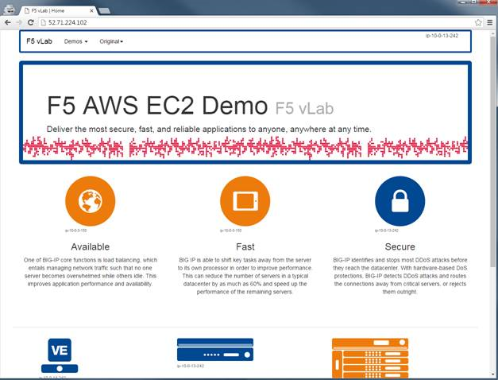

F5 Demo - PHP
======================

### About

Simple Docker PHP Container.

This is [F5 Contributed Software](https://support.f5.com/csp/article/K80012344)

### Requirements

   Docker 

### Usage

```
# simple page
docker run -p 8080:80
# simple website
```

Other variables for "website"

```
# change the title
-e F5DEMO_NODENAME='Your Website'
# change the color
-e F5DEMO_COLOR=656263
-e F5DEMO_COLOR=ffd734
-e F5DEMO_COLOR=0194d2
-e F5DEMO_COLOR=a0bf37
-e F5DEMO_COLOR=ed7b0c
-e F5DEMO_COLOR=004892
```



### Build

Note that you must run composer with PHP 7 prior to running docker build.

### Authored By

[Eric Chen](https://devcentral.f5.com/users/123940) | [@chen23](https://github.com/chen23)
